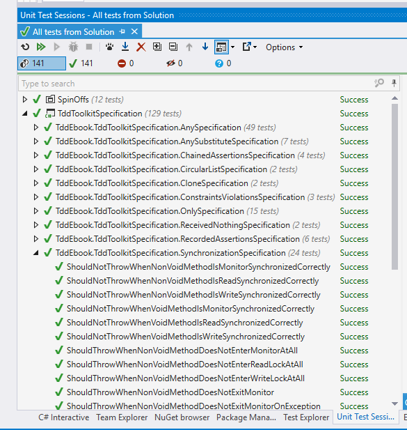

# The essential tools {#chapter-essential-tools}

Ever watched Karate Kid, either the old version or the new one? The thing they have in common is that when the "kid" starts learning karate (or kung-fu) from his master, he is given a basic, repetitive task (like taking off a jacket, and putting it on again), not knowing yet where it would lead him. Or look at the first Rocky film (yeah, the one starring Sylvester Stallone), where Rocky chases a chicken in order to train agility.

When I first tried to learn how to play guitar, I found two pieces of advice on the web: the first was to start by mastering a single, difficult song. The second was to play with a single string, learn how to make it sound in different ways and try to play some melodies by ear just with this one string. Do I have to tell you that the second advice worked better?

Honestly, I could dive right into the core techniques of TDD, but I feel this would be like putting you on a ring with a demanding opponent -- you would most probably be discouraged before gaining the necessary skills. So, instead of explaining how to win a race, in this chapter we will take a look at what shiny cars we will be driving.

In other words, I will give you a brief tour of the three tools we will use throughout this book.

In this chapter, I will oversimplify some things just to get you up and running without getting into the philosophy of TDD yet (think: physics lessons in primary school). Don't worry about it :-), I will make up for it in the coming chapters!

## Test framework

The first tool we'll use is a test framework. A test framework allows us to specify and execute our tests.

Let's assume for the sake of this introduction that we have an application that accepts two numbers from commandline, multiplies them and prints the result on the console. The code is pretty straightforward:

```csharp
public static void Main(string[] args) 
{
  try
  {
    int firstNumber = Int32.Parse(args[0]);
    int secondNumber = Int32.Parse(args[1]);

    var result = 
      new Multiplication(firstNumber, secondNumber).Perform();

    Console.WriteLine("Result is: " + result);
  }
  catch(Exception e)
  {
    Console.WriteLine("Multiplication failed because of: " + e);
  } 
}
```

Now, let's assume we want to check whether this application produces correct results. The most obvious way would be to invoke it from the command line manually with some exemplary arguments, then check the output to the console and compare it with what we expected to see. Such testing session could look like this:

```text
C:\MultiplicationApp\MultiplicationApp.exe 3 7
21
C:\MultiplicationApp\
```

As you can see, our application produces a result of 21 for the multiplication of 3 by 7. This is correct, so we assume the application has passed the test. 

Now, what if the application also performed addition, subtraction, division, calculus etc.? How many times would we have to invoke the application manually to make sure every operation works correctly? Wouldn't that be time-consuming? But wait, we are programmers, right? So we can write programs to do the testing for us! For example, here is a source code of a program that uses the Multiplication class, but in a slightly different way then the original application:

```csharp
public static void Main(string[] args) 
{
  var multiplication = new Multiplication(3,7);
  
  var result = multiplication.Perform();
  
  if(result != 21)
  {
    throw new Exception("Failed! Expected: 21 but was: " + result);
  }
}
```

Looks simple, right? Now, let's use this code as a basis to build a very primitive test framework, just to show the pieces that such frameworks consist of. As a step in that direction, we can extract the verification of the `result` into a reusable method -- after all, we will be adding division in a second, remember? So here goes:

```csharp
public static void Main(string[] args) 
{
  var multiplication = new Multiplication(3,7);
  
  var result = multiplication.Perform();
  
  AssertTwoIntegersAreEqual(expected: 21, actual: result);
}

//extracted code:
public static void AssertTwoIntegersAreEqual(
  int expected, int actual)
{
  if(actual != expected)
  {
    throw new Exception(
      "Failed! Expected: " 
        + expected + " but was: " + actual);
  }
}
```

Note that I started the name of this extracted method with "Assert" -- we will get back to the naming soon, for now just assume that this is a good name for a method that verifies that a result matches our expectation. Let's take one last round and extract the test itself so that its code is in a separate method. This method can be given a name that describes what the test is about:

```csharp
public static void Main(string[] args) 
{
  Multiplication_ShouldResultInAMultiplicationOfTwoPassedNumbers();
}

public void 
Multiplication_ShouldResultInAMultiplicationOfTwoPassedNumbers()
{
  //Assuming...
  var multiplication = new Multiplication(3,7);
  
  //when this happens:
  var result = multiplication.Perform();
  
  //then the result should be...
  AssertTwoIntegersAreEqual(expected: 21, actual: result);
}

public static void AssertTwoIntegersAreEqual(
  int expected, int actual)
{
  if(actual != expected)
  {
    throw new Exception(
    "Failed! Expected: " + expected + " but was: " + actual);
  }
}
```

And we're done. Now if we need another test, e.g. for division, we can just add a new method call to the `Main()` method and implement it. Inside this new test, we can reuse the `AssertTwoIntegersAreEqual()` method, since the check for division would also be about comparing two integer values.

As you see, we can easily write automated checks like this, using our primitive methods. However, this approach has some disadvantages:

1.  Every time we add a new test, we have to update the `Main()` method with a call to the new test. If we forget to add such a call, the test will never be run. At first it isn't a big deal, but as soon as we have dozens of tests, an omission will become hard to notice.
2.  Imagine your system consists of more than one application -- you would have some problems trying to gather summary results for all of the applications that your system consists of.
3.  Soon you'll need to write a lot of other methods similar to `AssertTwoIntegersAreEqual()` -- the one we already have compares two integers for equality, but what if we wanted to check a different condition, e.g. that one integer is greater than another? What if we wanted to check equality not for integers, but for characters, strings, floats etc.? What if we wanted to check some conditions on collections, e.g. that a collection is sorted or that all items in the collection are unique?
4.  Given a test fails, it would be hard to navigate from the commandline output to the corresponding line of the source in your IDE. Wouldn't it be easier if you could click on the error message to take you immediately to the code where the failure occurred?

For these and other reasons, advanced automated test frameworks were created such as CppUnit (for C++), JUnit (for Java) or NUnit (C#). Such frameworks are in principle based on the very idea that I sketched above, plus they make up for the deficiencies of our primitive approach. They derive their structure and functionality from Smalltalk's SUnit and are collectively referred to as **xUnit family** of test frameworks.

To be honest, I can't wait to show you how the test we just wrote looks like when a test framework is used. But first let's recap what we've got in our straightforward approach to writing automated tests and introduce some terminology that will help us understand how automated test frameworks solve our issues:

1.  The `Main()` method serves as a **Test List** -- a place where it is decided which tests to run.
2.  The `Multiplication_ShouldResultInAMultiplicationOfTwoPassedNumbers()` method is a **Test Method**.
3.  The `AssertTwoIntegersAreEqual()` method is an **Assertion** -- a condition that, when not met, ends a test with failure.

To our joy, those three elements are present as well when we use a test framework. Moreover, they are far more advanced than what we have. To illustrate this, here is (finally!) the same test we wrote above, now using the [xUnit.Net](http://xunit.github.io/) test framework:

```csharp
[Fact] public void 
Multiplication_ShouldResultInAMultiplicationOfTwoPassedNumbers()
{
  //Assuming...
  var multiplication = new Multiplication(3,7);
  
  //when this happens:
  var result = multiplication.Perform();
  
  //then the result should be...
  Assert.Equal(21, result);
}
```

Looking at the example, we can see that the test method itself is the only thing that's left -- the two methods (the test list and assertion) that we previously had are gone now. Well, to tell you the truth, they are not literally gone -- it's just that the test framework offers replacements that are far better, so we used them instead. Let's reiterate the three elements of the previous version of the test that I promised would be present after the transition to the test framework:

1.  The **Test List** is now created automatically by the framework from all methods marked with a `[Fact]` attribute. There's no need to maintain one or more central lists anymore, so the `Main()` method is no more.
2.  The **Test Method** is present and looks almost the same as before.
3.  The **Assertion** takes the form of a call to the static `Assert.Equal()` method -- the xUnit.NET framework is bundled with a wide range of assertion methods, so I used one of them. Of course, no one stops you from writing your own custom assertion if the built-in assertion methods don't offer what you are looking for.

Phew, I hope I made the transition quite painless for you. Now the last thing to add -- as there is no `Main()` method anymore in the last example, you surely must wonder how we run those tests, right? Ok, the last big secret unveiled -- we use an external application for this (we will refer to it using the term **Test Runner**) -- we tell it which assemblies to run and then it loads them, runs them, reports the results etc. A Test Runner can take various forms, e.g. it can be a console application, a GUI application or a plugin for an IDE. Here is an example of a test runner provided by a plugin for Visual Studio IDE called Resharper:



## Mocking framework

W> This introduction is written for those who are not proficient with using mocks. Even though, I accept the fact that the concept may be too difficult for you to grasp. If, while reading this section, you find youreslf lost, please skip it. We won't be dealing with mock objects until part 2, where I offer a richer and more accurate description of the concept.

When we want to test a class that depends on other classes, we may think it's a good idea to include those classes in the test as well. This, however, does not allow us to test a single object or a small cluster of objects in isolation, where we would be able to verify that just a small part of the application works correctly. Thankfully, if we make our classes depend on interfaces rather than other classes, we can easily implement those interfaces with special "fake" classes that can be crafted in a way that makes our testing easier. For example, objects of such classes may contain pre-programmed return values for some methods. They can also record the methods that are invoked on them and allow the test to verify whether the communication between our object under test and its dependencies is correct.

Nowadays, we can rely on tools to generate such a "fake" implementation of a given interface for us and let us use this generated implementation in place of a real object in tests. This happens in a different way, depending on a language. Sometimes, the interface implementations can be generated at runtime (like in Java or C#), sometimes we have to rely more on compile-time generation (e.g. in C++). 

Narrowing it down to C# -- a mocking framework is just that -- a mechanism that allows us to create objects (called "mock objects" or just "mocks"), that adhere to a certain interface, at runtime. It works like this: the type of the interface we want to have implemented is usually passed to a special method which returns a mock object based on that interface (we'll see an example in a few seconds). Aside from the creation of mock objects, such framework provides an API to configure the mocks on how they behave when certain methods are called on them and allows us to inspect which calls they received. This is a very powerful feature, because we can simulate or verify conditions that would be difficult to achieve or observe using only production code. Mocking frameworks are not as old as test frameworks so they haven't been used in TDD since the very beginning.

I'll give you a quick example of a mocking framework in action now and defer further explanation of their purpose to later chapters, as the full description of mocks and their place in TDD is not so easy to convey.

Let's pretend that we have a class that allows placing orders and then puts these orders into a database (using an implementation of an interface called `OrderDatabase`). In addition, it handles any exception that may occur, by writing it into a log. The class itself does not do any important stuff, but let's try to imagine really hard that this is some serious domain logic. Here's the code for this class:

```csharp
public class OrderProcessing
{
  OrderDatabase _orderDatabase; //OrderDatabase is an interface
  Log _log;

  //we get the database object  from outside the class:
  public OrderProcessing(
    OrderDatabase database,
    Log log)
  {
    _orderDatabase = database;
    _log = log;
  }

  //other code...

  public void Place(Order order)
  {
    try
    {
      _orderDatabase.Insert(order);
    }
    catch(Exception e)
    {
      _log.Write("Could not insert an order. Reason: " + e);
    }
  }

  //other code...
}
```

Now, imagine we need to test it -- how do we do that? I can already see you shake your head and say: "Let's just create a database connection, invoke the `Place()` method and see if the record is added properly into the database". If we did that, the first test would look like this:

```csharp
[Fact] public void 
ShouldInsertNewOrderToDatabaseWhenOrderIsPlaced()
{
  //GIVEN
  var orderDatabase = new MySqlOrderDatabase(); //uses real database
  orderDatabase.Connect();
  orderDatabase.Clean(); //clean up after potential previous tests
  var orderProcessing = new OrderProcessing(orderDatabase, new FileLog());
  var order = new Order(
    name: "Grzesiek", 
    surname: "Galezowski", 
    product: "Agile Acceptance Testing", 
    date: DateTime.Now,
    quantity: 1);

  //WHEN
  orderProcessing.Place(order);

  //THEN
  var allOrders = orderDatabase.SelectAllOrders();
  Assert.Contains(order, allOrders);
}
```

At the beginning of the test we open a connection to the database and clean all existing orders in it (more on that shortly), then create an order object, insert it into the database and query the database for all orders it contains. At the end, we make an assertion that the order we tried to insert is among all orders in the database.

Why do we clean up the database at the beginning of the test? Remember that a database provides persistent storage. If we don't clean it up before executing the logic of this test, the database may already contain the item we are trying to add, e.g. from previous executions of this test. The database might not allow us to add the same item again and the test would fail. Ouch! It hurts so bad, because we wanted our tests to prove something works, but it looks like it can fail even when the logic is coded correctly. Of what use would be such a test if it couldn't reliably tell us whether the implemented logic is correct or not? So, to make sure that the state of the persistent storage is the same every time we run this test, we clean up the database before each run.

Now that the test is ready, did we get what we wanted from it? I would be hesitant to answer "yes". There are several reasons for that:

1. The test will most probably be slow, because accessing database is relatively slow. It is not uncommon to have more than a thousand tests in a suite and I don't want to wait half an hour for results every time I run them. Do you?
2. Everyone who wants to run this test will have to set up a special environment, e.g. a local database on their machine. What if their setup is slightly different from ours? What if the schema gets outdated -- will everyone manage to notice it and update the schema of their local databases accordingly? Should we re-run our database creation script only to ensure we have got the latest schema available to run your tests against?
3. There may be no implementation of the database engine for the operating system running on our development machine if our target is an exotic or mobile platform.
4. Note that the test we wrote is only one out of two. We still have to write another one for the scenario where inserting an order ends with an exception. How do we setup the database in a state where it throws an exception? It is possible, but requires significant effort (e.g. deleting a table and recreating it after the test, for use by other tests that might need it to run correctly), which may lead some to the conclusion that it is not worth writing such tests at all.

Now, let's try to approach this problem in a different way. Let's assume that the `MySqlOrderDatabase` that queries a real database query is already tested (this is because I don't want to get into a discussion on testing database queries just yet - we'll get to it in later chapters) and that the only thing we need to test is the `OrderProcessing` class (remember, we're trying to imagine really hard that there is some serious domain logic coded here). In this situation we can leave the `MySqlOrderDatabase` out of the test and instead create another, fake implementation of the `OrderDatabase` that acts as if it was a connection to a database but does not write to a real database at all -- it only stores the inserted records in a list in memory. The code for such a fake connection could look like this: 

```csharp
public class FakeOrderDatabase : OrderDatabase
{
  public Order _receivedArgument;

  public void Insert(Order order)
  {
    _receivedArgument = order;
  }

  public List<Order> SelectAllOrders()
  {
    return new List<Order>() { _receivedOrder };
  }
}
```

Note that the fake order database is an instance of a custom class that implements the same interface as `MySqlOrderDatabase`. Thus, if we try, we can make the tested code use our fake without knowing. 

Let's replace the real implementation of the order database by the fake instance in the test:

```csharp
[Fact] public void 
ShouldInsertNewOrderToDatabaseWhenOrderIsPlaced()
{
  //GIVEN
  var orderDatabase = new FakeOrderDatabase();
  var orderProcessing = new OrderProcessing(orderDatabase, new FileLog());
  var order = new Order(
    name: "Grzesiek", 
    surname: "Galezowski", 
    product: "Agile Acceptance Testing", 
    date: DateTime.Now,
    quantity: 1);

  //WHEN
  orderProcessing.Place(order);

  //THEN
  var allOrders = orderDatabase.SelectAllOrders();
  Assert.Contains(order, allOrders);
}
```

Note that we do not clean the fake database object like we did with the real database, since we create a fresh object each time the test is run and the results are stored in a memory location different for each instance. The test will also be much quicker now, because we are not accessing the database anymore. What's more, we can now easily write a test for the error case. How? Just make another fake class, implemented like this:

```csharp
public class ExplodingOrderDatabase : OrderDatabase
{
  public void Insert(Order order)
  {
    throw new Exception();
  }

  public List<Order> SelectAllOrders()
  {
  }
}
```

Ok, so far so good, but now we have two classes of fake objects to maintain (and chances are we will need even more). Any method added to the `OrderDatabase` interface must also be added to each of these fake classes. We can spare some coding by making our mocks a bit more generic so that their behavior can be configured using lambda expressions:

```csharp
public class ConfigurableOrderDatabase : OrderDatabase
{
  public Action<Order> doWhenInsertCalled;
  public Func<List<Order>> doWhenSelectAllOrdersCalled;

  public void Insert(Order order)
  {
    doWhenInsertCalled(order);
  }

  public List<Order> SelectAllOrders()
  {
    return doWhenSelectAllOrdersCalled();
  }
}
```

Now, we don't have to create additional classes for new scenarios, but our syntax becomes awkward. Here's how we configure the fake order database to remember and yield the inserted order:

```csharp
var db = new ConfigurableOrderDatabase();
Order gotOrder = null;
db.doWhenInsertCalled = o => {gotOrder = o;};
db.doWhenSelectAllOrdersCalled = () => new List<Order>() { gotOrder };
```

And if we want it to throw an exception when anything is inserted:

```csharp
var db = new ConfigurableOrderDatabase();
db.doWhenInsertCalled = o => {throw new Exception();};
```

Thankfully, some smart programmers created libraries that provide further automation in such scenarios. One such a library is [**NSubstitute**](http://nsubstitute.github.io/). It provides an API in a form of C# extension methods, which is why it might seem a bit magical at first, especially if you're not familiar with C#. Don't worry, you'll get used to it.

Using NSubstitute, our first test can be rewritten as:

```csharp
[Fact] public void 
ShouldInsertNewOrderToDatabaseWhenOrderisPlaced()
{
  //GIVEN
  var orderDatabase = Substitute.For<OrderDatabase>();
  var orderProcessing = new OrderProcessing(orderDatabase, new FileLog());
  var order = new Order(
    name: "Grzesiek", 
    surname: "Galezowski", 
    product: "Agile Acceptance Testing", 
    date: DateTime.Now,
    quantity: 1);

  //WHEN
  orderProcessing.Place(order);

  //THEN
  orderDatabase.Received(1).Insert(order);
}
```

Note that we don't need the `SelectAllOrders()` method on the database connection interface anymore. It was there only to make writing the test easier -- no production code used it. We can delete the method and get rid of some more maintenance trouble. Instead of the call to `SelectAllOrders()`, mocks created by NSubstitute record all calls received and allow us to use a special method called `Received()` on them (see the last line of this test), which is actually a camouflaged assertion that checks whether the `Insert()` method was called with the order object as parameter.

This explanation of mock objects is very shallow and its purpose is only to get you up and running. We'll get back to mocks later as we've only scratched the surface here.

## Anonymous values generator

Looking at the test data in the previous section we see that many values are specified literally, e.g. in the following code:

```csharp
var order = new Order(
  name: "Grzesiek",
  surname: "Galezowski",
  product: "Agile Acceptance Testing",
  date: DateTime.Now,
  quantity: 1);
```

the name, surname, product, date and quantity are very specific. This might suggest that the exact values are important from the perspective of the behavior we are testing. On the other hand, when we look at the tested code again:

```csharp
public void Place(Order order)
{
  try
  {
    this.orderDatabase.Insert(order);
  }
  catch(Exception e)
  {
    this.log.Write("Could not insert an order. Reason: " + e);
  }
}
```

we can spot that these values are not used anywhere -- the tested class does not use or check them in any way. These values are important from the database point of view, but we already took the real database out of the picture. Doesn't it trouble you that we fill the order object with so many values that are irrelevant to the test logic itself and that clutter the structure of the test with needless details? To remove this clutter let's introduce a method with a descriptive name to create the order and hide the details we don't need from the reader of the test:

```csharp
[Fact] public void 
ShouldInsertNewOrderToDatabase()
{
  //GIVEN
  var orderDatabase = Substitute.For<OrderDatabase>();
  var orderProcessing = new OrderProcessing(orderDatabase, new FileLog());
  var order = AnonymousOrder();

  //WHEN
  orderProcessing.Place(order);

  //THEN
  orderDatabase.Received(1).Insert(order);
}

public Order AnonymousOrder()
{
  return new Order(
    name: "Grzesiek", 
    surname: "Galezowski", 
    product: "Agile Acceptance Testing", 
    date: DateTime.Now,
    quantity: 1);
}
```

Now, that's better. Not only did we make the test shorter, we also provided a hint to the reader that the actual values used to create an order don't matter from the perspective of tested order-processing logic. Hence the name `AnonymousOrder()`.

By the way, wouldn't it be nice if we didn't have to provide the anonymous objects ourselves, but could rely on another library to generate these for us? Susprise, surprise, there is one! It's called [**Autofixture**](https://github.com/AutoFixture/AutoFixture). It is an example of so-called anonymous values generator (although its creator likes to say that it is also an implementation of Test Data Builder pattern, but let's skip this discussion here). 

After changing our test to use AutoFixture, we arrive at the following:

```csharp
private Fixture any = new Fixture();

[Fact] public void 
ShouldInsertNewOrderToDatabase()
{
  //GIVEN
  var orderDatabase = Substitute.For<OrderDatabase>();
  var orderProcessing = new OrderProcessing(orderDatabase, new FileLog());
  var order = any.Create<Order>();

  //WHEN
  orderProcessing.Place(order);

  //THEN
  orderDatabase.Received(1).Insert(order);
}
```

In this test, we use an instance of a `Fixture` class (which is a part of AutoFixture) to create anonymous values for us via a method called `Create()`. This allows us to remove the `AnonymousOrder()` method, thus making our test setup shorter.

Nice, huh? AutoFixture has a lot of advanced features, but to keep things simple I like to hide its use behind a static class called `Any`. The simplest implementation of such class would look like this:

```csharp
public static class Any
{
  private static any = new Fixture();
  
  public static T Instance<T>()
  {
    return any.Create<T>();
  }
}
```

In the next chapters, we'll see many different methods from the `Any` type, plus the full explanation of the philosophy behind it. The more you use this class, the more it grows with other methods for creating customized objects.

## Summary

This chapter introduced the three tools we'll use in this book that, when mastered, will make your test-driven development flow smoother. If this chapter leaves you with insufficient justification for their use, don't worry -- we will dive into the philosophy behind them in the coming chapters. For now, I just want you to get familiar with the tools themselves and their syntax. Go on, download these tools, launch them, try to write something simple with them. You don't need to understand their full purpose yet, just go out and play :-).
