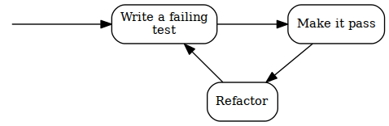
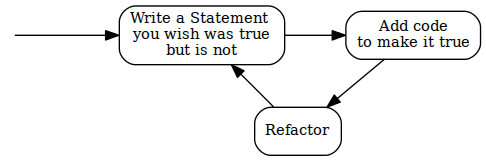

# Statement-first programming

## What's the point of writing a specification after the fact?

One of the best known thing about TDD is that a failing test for a behavior of a piece of code is written before this behavior is implemented. This concept is often called "test-first development" and seems controversial to many.

In the previous chapter, I said that in TDD a "test" takes an additional role -- one of a statement that is part of a specification. If we put it this way, then the whole controversial concept of "writing a test before the code" does not pose a problem at all. Quite the contrary -- it only seems natural to specify what we expect from a piece of code to do before we attempt to write it. Does the other way round even make sense? A specification written after completing the implementation is nothing more than an attempt at documenting the existing solution. Sure, such attempts can provide some value when done as a kind of reverse-engineering (i.e. writing the specification for something that was implemented long ago and for which we uncover the previously implicit business rules or policies as we document the existing solution) -- it has an excitement of discovery in it, but doing so just after we made all the decisions ourselves doesn't seem to me like a productive way to spend my time, not to mention that I find it dead boring (you can check whether you're like me on this one. Try implementing a simple calculator app and then write specification for it just after it is implemented and manually verified to work). Anyway, I hardly find specifying how something should work after it works creative. Maybe that's the reason why, throughout the years, I have observed the specifications written after a feature is implemented to be much less complete than the ones written before the implementation.

Oh, and did I tell you that without a specification of any kind we don't really know whether we are done implementing our changes or not? This is because in order to determine if the change is complete, we need to compare the implemented functionality to "something", even if this "something" is only in the customer's head. in TDD, we "compare" it to expectations set by a suite of automated tests.

Another thing I mentioned in the previous chapter is that we approach writing a Specification of executable Statements differently from writing a textual design or requirements specification: even though a behavior is implemented after its Specification is ready, we do not write the Specification entirely up-front. The usual sequence is to specify a bit first and then code a bit, repeating it one Statement at a time. When doing TDD, we are traversing repeatedly through a few phases that make up a cycle. We like these cycles to be short, so that we get feedback early and often. This is essential, because it allows us to move forward, confident that what we already have works as we intended. It also enables us to make the next cycle more efficient thanks to the knowledge we gained in the previous cycle (if you don't believe me that fast feedback matters, ask yourself a question: "how many times a day do I compile the code I'm working on?").

Reading so much about cycles, it is probably no surprise that the traditional illustration of the TDD process is modeled visually as a circular flow:



Note that the above form uses the traditional terminology of TDD, so before I explain the steps, here's a similar illustration that uses our terms of Specification and Statements: 



The second version seems more like common sense than the first one -- specifying how something should behave before putting that behavior in place is way more intuitive than testing something that does not yet exist.

Anyway, these three steps deserve some explanation. In the coming chapters I'll give you some examples of how this process works in practice and introduce an expanded version, but in the meantime it suffices to say that:

Write a Statement you wish were true but is not
:   means that the Statement evaluates to false. In the test list it appears as failing, which most xUnit frameworks mark with red color.

Add code to make it true
:   means that we write just enough code to make the Statement true. In the test list it appears as passing, which most xUnit frameworks mark with green color. Later in the course of the book you'll see how little can be "just enough".

Refactor
:   is a step that I have silently ignored so far and will do so for several more chapters. Don't worry, we'll get back to it eventually. For now it's important to be aware that the executable Specification can act as a safety net while we are improving the quality of the code without changing its externally visible behavior: by running the Specification often, we quickly discover any mistake we make in the process.

By the way, this process is sometimes referred to as "Red-Green-Refactor", because of the colors that xUnit tools display for failing and passing test. I am just mentioning it here for the record -- I will not be using this term further in the book.

## "Test-First" means seeing a failure

Explaining the illustration with the TDD process above, I pointed out that we are supposed to write a Statement that we wish was true **but is not**. It means that not only do we have to write a Statement before we provide implementation that makes it true, we also have to evaluate it (i.e. run it) and watch it fail its assertions before we provide the implementation. 

Why is it so important? Isn't it enough to write the Statement first? Why run it and watch it fail? There are several reasons and I will try to outline some of them briefly.

The main reason for writing a Statement and watching it fail is that otherwise, I don't have any proof that the Statement can ever fail.

Every accurate Statement fails when it isn't fulfilled and passes when it is. That's one of the main reasons why we write it -- to see this transition from *red* to *green*, which means that what previously was not implemented (and we had a proof for that) is now working (and we have a proof). Observing the transition proves that we made progress. 

Another thing to note is that, after being fulfilled, the Statement becomes a part of the executable specification and starts failing as soon as the code stops fulfilling it, for example as a result of a mistake made during code refactoring. 

Seeing a Statement proven as false gives us valuable feedback. If we run a Statement only *after* the behavior it describes has been implemented and it is evaluated as true, how do we know whether it really accurately describes a need? We never saw it failing, so what proof do we have that it ever will?

The first time I encountered this argument was before I started thinking of tests as executable specification. "Seriously?" -- I thought -- "I know what I'm writing. If I make my tests small enough, it is self-evident that I am describing the correct behavior. This is paranoid". However, life quickly verified my claims and I was forced to withdraw my arguments. Let me describe three of the ways I experienced of how one can write a Statement that is always true, whether the code is correct or not. There are more ways, however I think giving you three should be an illustration enough. 

Test-first allowed me to avoid the following situations where Statements cheated me into thinking they were fulfilled even when they shouldn't be:

### 1. Accidental omission of including a Statement in a Specification

It's usually insufficient to just write the code of a Statement - we also have to let the test runner know that a method we wrote is really a Statement (not e.g. just a helper method) and it needs to be evaluated, i.e. ran by the runner. 

Most xUnit frameworks have some kind of mechanism to mark methods as Statements, whether by using attributes (C#, e.g. `[Fact]`) or annotations (Java, e.g `@Test`), or by using macros (C and C++), or by using a naming convention. We have to use such a mechanism to let the runner know that it should execute such methods.

Let's take xUnit.Net as an example. To turn a method into a Statement in xUnit.Net, we have to mark it with the `[Fact]` attribute like this:

```csharp
public class CalculatorSpecification
{
  [Fact]
  public void ShouldDisplayAdditionResultAsSumOfArguments()
  {
    //...
  }
}
```

There is a chance that we forget to decorate a method with the `[Fact]` attribute - in such case, this method is never executed by the test runner. However funny it may sound, this is exactly what happened to me several times. Let's take the above Statement as an example and imagine that we are writing this Statement post-factum as a unit test in an environment that has, let's say, more than thirty Statements already written and passing. We have written the code and now we are just creating test after test to ensure the code works. Test -- pass, test -- pass, test -- pass. When I execute tests, I almost always run more than one at a time, since it's easier for me  than selecting what to evaluate each time. Besides, I get more confidence this way that I don't make a mistake and break something that is already working. Let's imagine we are doing the same here. Then the workflow is really: Test -- all pass, test -- all pass, test -- all pass... 

Over the time, I have learned to use code snippets mechanism of my IDE to generate a template body for my Statements. Still, in the early days, I have occasionally written something like this:

```csharp
public class CalculatorSpecification
{
  //... some Statements here

  //oops... forgot to insert the attribute!
  public void ShouldDisplayZeroWhenResetIsPerformed()
  {
    //...
  }
}
```

As you can see, the `[Fact]` attribute is missing, which means this Statement will not be executed. This has happened not only because of not using code generators -- sometimes -- to create a new Statement -- it made sense to copy-paste an existing Statement, change the name and few lines of code[^copypaste]. I didn't always remember to include the `[Fact]` attribute in the copied source code. The compiler was not complaining as well.

The reason I didn't see my mistake was because I was running more than once at a time - when I got a green bar (i.e. all Statements proven true), I assumed that the Statement I just wrote works as well. It was unattractive for me to search for each new Statement in the list and make sure it's there. The more important reason, however, was that the absence of the `[Fact]` attribute did not disturb my work flow: test -- all pass, test -- all pass, test -- all pass... In other words, my process did not give me any feedback that I made a mistake. So, in such case, what I end up with is a Statement that not only will never be proven false -- **it won't be evaluated at all**.

How does treating tests as Statements and evaluating them before making them true help here? The fundamental difference is that the workflow of TDD is: test -- fail -- pass, test -- fail -- pass, test -- fail -- pass... In other words, we expect each Statement to be proven false at least once. So every time we miss the "fail" stage, we get feedback from our process that something suspicious is happening. This allows us to investigate and fix the problem if necessary.

### 2. Misplacing test setup

Ok, this may sound even funnier, but it happened to me a couple of times as well, so I assume it may happen to you one day, especially if you are in a hurry.

Consider the following toy example: we want to validate a simple data structure that models a frame of data that can arrive via network. The structure looks like this:

```csharp
public class Frame
{
  public int timeSlot;
}
```

and we need to write a Specification for a `Validation` class that accepts a `Frame` as an argument and checks whether the time slot (whatever it is) is above a value specified in a constant called `TimeSlot.MaxAllowed` (so it's a constant defined in a `TimeSlot` class). If it is, then the validation returns `false`, if it's not, then it returns `true`.

Let's take a look at the following Statement which specifies that setting a value higher than allowed to a field of a `frame` should make the validation fail:

```csharp
[Fact]
public void ShouldRecognizeTimeSlotAboveMaximumAllowedAsInvalid()
{
  var frame = new Frame();
  var validation = new Validation();
  var timeSlotAboveMaximumAllowed = TimeSlot.MaxAllowed + 1;
  var result = validation.PerformForTimeSlotIn(frame);
  frame.timeSlot = timeSlotAboveMaximumAllowed;
  Assert.False(result);
}
```

Note how the method `PerformForTimeSlotIn()`, which triggers the specified behavior, is accidentally called *before* a value of `timeSlotAboveMaximumAllowed` is set up and thus, this value is not taken into account at the moment when the validation is executed. If, for example, we make a mistake in the implementation of the `Validation` class so that it returns `false` for values below the maximum and not above, such mistake may go unnoticed, because the Statement will always be true.

Again, this is a toy example - I just used it as an illustration of something that can happen when dealing with more complex cases.

### 3. Using static data inside production code

Once in a while, we have to jump in and add some new Statements to an existing Specification and some logic to the class it describes. Let's assume that the class and its Specification were written by someone else than us. Imagine the code we are talking about is a wrapper around our product XML configuration file. We decide to write our Statements *after* applying the changes ("well", we may say, "we're all protected by the Specification that is already in place, so we can make our change without the risk of accidentally breaking existing functionality, and then just test our changes and it's all good...").

We start coding... done. Now we start writing this new Statement that describes the functionality we just added. After examining the Specification class, we can see that it has a member field like this:

```csharp
public class XmlConfigurationSpecification
{
  XmlConfiguration config = new XmlConfiguration(xmlFixtureString);
  
  //...
```

What it does is it sets up an object used by every Statement. So, each Statement uses a `config` object initialized with the same `xmlConfiguration` string value. Another quick examination leads us to discovering the following content of the `xmlFixtureString`:


```xml
<config>
  <section name="General Settings">
    <subsection name="Network Related">
      <parameter name="IP">192.168.3.2</parameter>
      <parameter name="Port">9000</parameter>
      <parameter name="Protocol">AHJ-112</parameter>
    </subsection>
      <subsection name="User Related">
      <parameter name="login">Johnny</parameter>
      <parameter name="Role">Admin</parameter>
      <parameter name="Password Expiry (days)">30</parameter>
    /subsection>
    <!-- and so on and on and on...-->
  </section>
</config>
```

 The string is already pretty large and messy, since it contains all information that is required by the existing Statements. Let's assume we need to write tests for a little corner case that does not need all this crap inside this string. So, we decide to start afresh and create a separate object of the `XmlConfiguration` class with your own, minimal string. Our Statement begins like this:

```csharp
string customFixture = CreateMyOwnFixtureForThisTestOnly();
var configuration = new XmlConfiguration(customFixture);
...
```

And goes on with the scenario. When we execute it, it passes -- cool... not. Ok, what's wrong with this? At the first sight, everything's OK, until we read the source code of XmlConfiguration class carefully. Inside, we can see, how the XML string is stored:

```csharp
private static string xmlText; //note the static keyword!
```

It's a static field, which means that its value is retained between instances. What the...? Well, well, here's what happened: the author of this class applied a small optimization. He thought: "In this app, the configuration is only modified by members of the support staff and to do it, they have to shut down the system, so, there is no need to read the XML file every time an XmlConfiguration object is created. I can save some CPU cycles and I/O operations by reading it only once when the first object is created. Later objects will just use the same XML!". Good for him, not so good for us. Why? Because, depending on the order in which the Statements are evaluated, either the original XML string will be used for all Statements or your custom one! Thus the Statements in this Specification may pass or fail for the wrong reason - because they accidentally use the wrong XML. 

Starting development from a Statement that we expect to fail may help when such a Statement passes despite the fact that the behavior it describes is not implemented yet.

## "Test-After" often ends up as "Test-Never"

Consider again the question I already asked in this chapter: did you ever have to write a requirements or design document for something that you already implemented? Was it fun? Was it valuable? Was it creative? As for me, my answer to these questions is *no*. I observed that the same answer applied to writing my executable Specification. By observing myself and other developers, I came to a conclusion that after we've written the code, we have little motivation to specify what we wrote -- some of the pieces of code "we can just see are correct", other pieces "we already saw working" when we compiled and deployed our changes and ran a few manual checks... The design is ready... Specification? Maybe next time... Thus, the Specification may never get to be written at all and if it is written, I often find that it covers most of the the main flow of the program, but lacks some Statements saying what should happen in case of errors etc.

Another reason for ending up not writing the Specification might be time pressure, especially in teams that are not yet mature or not have very strong professional ethics. Many times, I have seen people reacting to pressure by dropping everything besides writing the code that directly implements a feature. Among the things that get dropped are design, requirements and tests. And learning as well. I have seen many times teams that, when under pressure, stopped experimenting and learning and reverted to old "safe" behaviors in a mindset of "saving a sinking ship" and "hoping for the best". As in such situations I've seen pressure raise as the project approached its deadline or milestone, leaving Specification until the end means that its's very likely to get dropped, especially in case when the changes are (to a degree) tested manually later anyway.

On the other hand, when doing TDD (as we will see in the coming chapters) our Specification grows together with the production code, so there is much less temptation to drop it entirely. Moreover, In TDD, a written Specification Statement is not an addition to the code, but rather *a reason* to write the code. Creating an executable Specification becomes indispensable part of implementing a feature.

## "Test-After" often leads to design rework

I like reading and watching Uncle Bob (Robert C. Martin). One day I was listening to [his keynote at Ruby Midwest 2011, called Architecture The Lost Years](http://www.confreaks.com/videos/759-rubymidwest2011-keynote-architecture-the-lost-years). At the end, Robert made some digressions, one of them about TDD. He said that writing tests after the code is not TDD and instead called it "a waste of time".

My initial thought was that the comment was maybe a bit too exaggerated and only about missing all the benefits that starting with a false Statement brings me: the ability to see the Statement fail, the ability to do a clean-sheet analysis etc. However, now I feel that there's much more to it, thanks to something I learned from Amir Kolsky and Scott Bain -- in order to be able to write a maintainable Specification for a piece of code, the code must have a high level of **testability**. We will talk about this quality in part 2 of this book, but for now let's assume the following simplified definition: the higher testability of a piece of code (e.g. a class), the easier it is to write a Statement for its behavior.

Now, where's the waste in writing the Specification after the code is written? To find out, let's compare the Statement-first and code-first approaches. In the Statement-first workflow for new (non-legacy) code, my workflow and approach to testability usually look like this: 

1. Write a Statement that is false to start with (during this step, detect and correct testability issues even before the production code is written).
2. Write code to make the Statement true.

And here's what I often see programmers do when they write the code first (extra steps marked with **strong text**):

1. Write some production code without considering how it will be tested (after this step, the testability is often suboptimal as it's usually not being considered at this point).
2. **Start writing a unit test** (this might not seem like an extra step, since it's also present in the previous approach, but once you reach the step 5, you'll know what I mean). 
3. **Notice that unit testing the code we wrote is cumbersome and unsustainable and the tests become looking messy as they try to work around the testability issues.**
4. **Decide to improve testability by restructuring the code, e.g. to be able to isolate objects and use techniques such as mock objects.**
5. Write unit tests (this time it should be easier as the testability of the tested is better).

What is the equivalent of the marked steps in the Statement-first approach? There is none! Doing these things is a waste of time! Sadly, this is a waste I encounter a lot.

## Summary

In this chapter, I tried to show you that the choice of *when* we write our Specification often makes a huge difference  and that there are numerous benefits of starting with a Statement. When we consider the Specification as what it really is - not only as a suite of tests that check runtime correctness - then Statement-first approach becomes less awkward and less counter-intuitive.

[^copypaste]: I know copy-pasting code is considered harmful and we shouldn't be doing that. When writing unit-level Statements, I make some exceptions from that rule. This will be explained in part 2.

