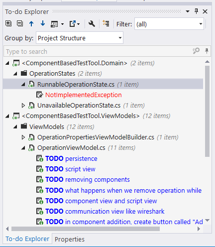

# How is TDD about analysis and what does "GIVEN-WHEN-THEN" mean?

During the work on the calculator code, Johnny mentioned that TDD is, among other things, about analysis. This chapter further explores this concept. Let's start by answering the following question:

## Is there really a commonality between analysis and TDD?

From [Wikipedia](https://en.wikipedia.org/wiki/Analysis):

> Analysis is the process of breaking a complex topic or substance into smaller parts to gain a better understanding of it.

Thus, for TDD to be about analysis, it would have to fulfill two conditions:

1. It would have to be a process of breaking a complex topic into smaller parts
1. It would have to allow gaining a better understanding of such smaller parts

In the story about Johnny, Benjamin and Jane, I included a part where they analyze requirements using concrete examples. Johnny explained that this is a part of process called Acceptance Test-Driven Development. This process, followed by the three characters, fulfilled both mentioned conditions for it to be considered analytical. But what about TDD itself?

Although I used parts of the ATDD process in the story to make the analysis part more obvious, similar things happen at pure technical levels. For example, when starting development with a failing application-wide Statement (i.e. one that covers a behavior of an application as a whole. We will talk about levels of granularity of Statements later. For now the only thing you need to know is that the so called "unit tests level" is not the only level of granularity we write Statements on), we may encounter a situation where we need to call a web method and make an assertion on its result. This makes us think: how should this method be named? What are the scenarios it supports? What do I expect to get out of it? How should I, as its user, be notified about errors? Many times, this leads us to either a conversation (if there is another stakeholder that needs to be involved in the decision) or rethinking our assumptions. The same applies on "unit level" - if a class implements a domain rule, there might be some good domain-related questions resulting from trying to write a Statement for it. If a class implements a technical rule, there might be some technical questions to discuss with other developers etc. This is how we gain a better understanding of the topic we are analyzing, which makes TDD fulfill the second of the two requirements for it to be an analysis method.

But what about the first requirement? What about breaking a complex logic into smaller parts?

If you go back to Johnny and Benjamin's story, you will note that when talking to a customer and when writing code, they used a TODO list. This list was first filled with whatever scenarios they came up with, but later, they would add smaller units of work. When doing TDD, I do the same, essentially decomposing complex topics into smaller items and putting them on the TODO list (this is one of the practices that serve decomposition. The other one is mocking, but let's leave that for now). Thanks to this, I can focus on one thing at a time, crossing off item after item from the list after it's done. If I learn something new or encounter a new issue that needs our attention, I can add it to the TODO list and get back to it later, for now continuing my work on the current item of focus.

An example TODO list from the middle of an implementation task may look like this (don't read through it, I put it here just to give you a glimpse - you're not supposed to understand what the list items are about either):

1. ~~Create an entry point to the module (top-level abstraction)~~
1. ~~Implement main workflow of the module~~
1. ~~Implement `Message` interface~~
1. ~~Implement `MessageFactory` interface~~
1. Implement `ValidationRules` interface
1. ~~Implement behavior required from Wrap method in `LocationMessageFactory` class~~
1. Implement behavior required from ValidateWith method in `LocationMessage` class for Speed field
1. Implement behavior required from ValidateWith method in `LocationMessage` class for Age field
1. Implement behavior required from ValidateWith method in `LocationMessage` class for Sender field

Note that some of the items are already crossed off as done, while others remain pending and waiting to be addressed. All these items are what the article on Wikipedia calls "smaller parts" - a result of breaking down a bigger topic. 

For me, the arguments that I gave you are enough to think that TDD is about analysis. The next question is: are there any tools we can use to aid and inform this analysis part of TDD? The answer is yes and you already saw both of them in this book, so now we're going to have a closer look.

## Gherkin

Hungry? Too bad, because the Gherkin I am going to tell you about is not edible. It is a notation and a way of thinking about behaviors of the specified piece of code. It can be applied on different levels of granularity -- any behavior, whether of a whole system or a single class, may be described using Gherkin.

In fact we already used this notation, we just didn't name it so. Gherkin is the GIVEN-WHEN-THEN structure that you can see everywhere, even as comments in the code samples. This time, we are stamping a name on it and analyzing it further.

In Gherkin, a behavior description consists mostly of three parts:

1.  Given -- a context
2.  When -- a cause
3.  Then -- an effect

In other words, the emphasis is on causality in a given context. There's also a fourth keyword: `And`[^gherkinorandbut] -- we can use it to add more context, more causes or more effects. You'll have a chance to see an example in a few seconds

As I said, there are different levels you can apply this. Here is an example for such a behavior description from the perspective of its end user (this is called acceptance-level Statement):

```gherkin
Given a bag of tea costs $20
And there is a discount saying "pay half for a second bag"
When I buy two bags
Then I should be charged $30
```

And here is one for unit-level (note again the line starting with "And" that adds to the context):

```gherkin
Given a list with 2 items
When I add another item
And check items count
Then the count should be 3
```

While on acceptance level we put such behavior descriptions together with code as a single whole (If this doesn't ring a bell, look at tools such as [SpecFlow](http://www.specflow.org/) or [Cucumber](https://cucumber.io/) or [FIT](http://fit.c2.com/) to get some examples), on the unit level the description is usually not written down in a literal way, but rather it is translated and written only in form of source code. Still, the structure of GIVEN-WHEN-THEN is useful when thinking about behaviors required from an object or objects, as we saw when we talked about starting from Statement rather than code. I like to put the structure explicitly in my Statements -- I find that it helps make them more readable[^sebrosegwt]. So most of my unit-level Statements follow this template:

```csharp
[Fact]
public void Should__BEHAVIOR__()
{
  //GIVEN
  ...context...

  //WHEN
  ...trigger...

  //THEN
  ...assertions etc....
}
```

Sometimes the WHEN and THEN sections are not so easily separable -- then I join them, like in case of the following Statement specifying that an object throws an exception when asked to store null:

```csharp
[Fact]
public void ShouldThrowExceptionWhenAskedToStoreNull()
{
  //GIVEN
  var safeList = new SafeList();

  //WHEN - THEN
  Assert.Throws<Exception>(
    () => safeList.Store(null)
  );
}
```

By thinking in terms of these three parts of behavior, we may arrive at different circumstances (GIVEN) at which the behavior takes place, or additional ones that are needed. The same goes for triggers (WHEN) and effects (THEN). If anything like this comes to our mind, we add it to the TODO list to revisit it later.

## TODO list... again!

As I wrote earlier, a TODO list is a repository for our deferred work. This includes anything that comes to our mind when writing or thinking about a Statement, but is not a part of the current Statement we are writing. On one hand, we don't want to forget it, on the other - we don't want it to haunt us and distract us from our current task, so we write it down as soon as possible and continue with our current task. When we'are finished with it, we take another item from TODO list and start working on it.

Imagine we're writing a piece of logic that allows users access when they are employees of a zoo, but denies access if they are merely guests of the zoo. Then, after starting writing a Statement we realize that employees can be guests as well -- for example, they might choose to visit the zoo with their families during their vacation. Still, the two previous rules hold, so to avoid being distracted by this third scenario, we can quickly add it as an item to the TODO list (like "TODO: what if someone is an employee, but comes to the zoo as a guest?") and finish the current Statement. When we're finished, you can always come back to the list of deferred items and pick next item to work on.

There are two important questions related to TODO lists: "what exactly should we add as a TODO list item?" and "How to efficiently manage the TODO list?". We will take care of these two questions now.

### What to put on a TODO list?

Everything that we need addressed but is out of scope of the current Statement. Those items may be related to implementing unimplemented methods, to add whole functionalities (such items are usually broken further into more fine-grained sub tasks as soon as we start implementing them), they might be reminders to take a better look at something (e.g. "investigate what is this component's policy for logging errors") or questions about the domain that need to get answered. If we tend to get carried away too much in coding and miss our lunch, we can even add a reminder ("TODO: eat lunch!"). I have never encountered a case where I needed to share this TODO list with anyone else, so I tend to treat it as my personal sketchbook. I recommend the same to you - the list is yours!

### How to pick items from a TODO list?

Which item to choose from a TODO list when we have several of them? I have no clear rule, although I tend to take into account the following factors:

1. Risk -- if what I learn by implementing or discussing a particular item from the list can have a big impact on design or behavior of the system, I tend to pick such items first. An example of such item is when I start implementing validation of a request that arrives to my application and want to return different error depending on which part of the request is wrong. Then, during the development, I may discover that more than one part of the request can be wrong at the same time and I have to answer a question: which error code should be returned in such case? Or maybe the return codes should be accumulated for all validations and then returned as a list?
1. Difficulty -- depending on my mental condition (how tired I am, how much noise is currently around my desk etc.), I tend to pick items with difficulty that best matches this condition. For example, after finishing an item that requires a lot of thinking and figuring things out, I tend to take on some small and easy items to feel wind blowing in my sails and to rest a little bit. 
1. Completeness -- in simplest words, when I finish test-driving an "if" case, I usually pick up the "else" next. For example, after I finish implementing a Statement saying that something should return true for values less than 50, then the next item to pick up is the "greater or equal to 50" case. Usually, when I start test-driving a class, I take items related to this class until I run out of them, then go on to another one.

Of course, a TODO list is just one source of such TODO items. Typically, when searching for items to do, I examine the following sources of items in the following order:

1. compiler failures,
1. Statements that are false,
1. My TODO list.

### Where to put a TODO list?

I encountered two ways of maintaining a TODO list. The first one is on a sheet of paper. The drawback is that every time I need to add something to the list, I need to take my hands off the keyboard, grab a pen or a pencil and then get back to coding. Also, the only way a TODO item written on a sheet of paper can tell me which place in my code it is related to, is (obviously) by its text. The good thing about paper is that it is by far one of the best tools for sketching, so when my TODO item is best stored as a diagram or a drawing (which doesn't happen too often, but sometimes does) , I use pen and paper.

The second alternative is to use a TODO list functionality built-in into an IDE. Most IDEs, such as Visual Studio (and Resharper plugin has its own enhanced version), Xamarin Studio, IntelliJ or eclipse-based IDEs have such functionality. The rules are simple -- I insert special comments (e.q. `//TODO do something`) in the code and a special view in my IDE aggregates them for me, allowing me to navigate to each item later. This is my primary way of maintaining a TODO list, because:

1. They don't force me to take my hands off my keyboard to add an item to the list.
1. I can put a TODO item in a certain place in the code where is makes sense and then navigate back to it later with a click of a mouse. This, apart from other advantages, allows writing shorter notes than if I had to do it on paper. For example, a TODO item saying "TODO: what if it throws an exception?" looks out of place on a sheet of paper, but when added as a comment to my code in the right place, it's sufficient.
1. Many TODO lists automatically add items for certain things that happen in the code. E.g. in C\#, when I'm yet to implement a method that was automatically generated by the IDE, its body usually consists of a line that throws a `NotImplementedException` exception. Guess what -- `NotImplementedException` occurences are added to the TODO list automatically, so I don't have to manually add items to the TODO list for implementing the methods where they occur.



The TODO list maintained in the source code has one minor drawback - we have to remember to clear the list when we finish working with it or we may end up pushing the TODO items to the source control repository along with the rest of the source code. Such leftover TODO items may accumulate in the code, effectively reducing the ability to navigate through the items that were only added by a specific developer. There are several strategies of dealing with this:

1. For greenfield projects, I found it relatively easy to set up a static analysis check that runs when the code is built and doesn't allow the automatic build to pass unless all TODO items are removed. This helps ensure that whenever a change is pushed to a version control system, it's stripped of the unaddressed TODO items.
1. In some other cases, it's possible to use a strategy of removing all TODO items from a project before starting working with it. Sometimes it may lead to conflicts between people when TODO items are used for something else than a TDD task list and someone for whatever reason wants them to stay in the code longer. Even though I'm of opinion that such cases of leaving TODO items for longer should be extremely rare at best, however, others may have different opinions.
1. Most modern IDEs offer support markers other than `//TODO` for placing items on a TODO list, for example, `//BUG`. In such case, I can use the `//BUG` marker to mark just my items and then I can filter other items out based on that marker. Bug markers are commonly not intended to be left in the code, so it's much less risky for them to accumulate.
1. As a last resort technique, I can usually define my own markers to be placed on TODO list and, again, use filters to see only the items that were defined by me (plus usually `NotImplementedException`s).

### TDD process expanded with a TODO list 

In one of the previous chapters, I introduced you to the basic TDD process that contained three steps: write false Statement you wish was true, change the production code so that the Statement is true and then refactor the code. TODO list adds new steps to this process leading to the following expanded list:

1.  Examine TODO list and pick an item that makes most sense to implement next.
2.  Write false Statement you wish was true.
3.  See it reported as false for the right reason.
4.  Change the production code to make the Statement true and make sure all already true Statements remain true.
5.  Cross off the item from the TODO list.
6.  Repeat steps 1-5 until no item is left on the TODO list.

Of course, we can (and should) add new items to the TODO list as we make progress with the existing ones and at the beginning of each cycle the list should be re-evaluated to choose the most important item to implement next, also taking into account the things that were added during the previous cycle.

### Potential issues with TODO lists

There are also some issues one may run into when using TODO lists. I already mentioned the biggest of them - that I often saw people add TODO items for means other than to support TDD and they never went back to these items. Some people joke that a TODO comment left in the code means "There was a time when I wanted to do ...". Anyway, such items may pollute our TDD-related TODO list with so much cruft that your own items are barely findable.

Another downside is that when you work with multiple workspaces/solutions, your IDE will gather TODO items only from a single solution/workspace, so there may be times when several TODO lists will need to be maintained -- one per workspace or solution. Fortunately, this isn't usually a big deal.

[^sebrosegwt]: Seb Rose wrote a blog post where he suggests against the `//GIVEN //WHEN //THEN` comments and states that he only uses empty lines to separate the three sections, see http://claysnow.co.uk/unit-tests-are-your-specification/

[^gherkinorandbut]: Some claim there are other keywords, like `But` and `Or`. However, we won't need to resort to them so I decided to ignore them in this description.
