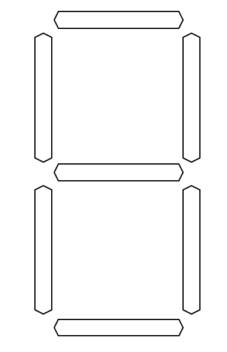

# Driving the implementation from Specification

As one of the last topics of the core TDD techniques that don't require us to delve into the object-oriented design world, I'd like to show you three techniques for turning a false Statement true. The names of the techniques come from a book by Kent Beck, [Test-Driven Development: By Example](http://www.pearsonhighered.com/educator/product/Test-Driven-Development-By-Example/9780321146533.page) and are:

1. Type the obvious implementation
1. Fake it (`til you make it)
1. Triangulate

Don't worry if these names don't tell you anything, the techniques are not that difficult to grasp and I will try to give an example of each of them.

## Type the obvious implementation

The first technique simply says: when you know the correct and final implementation to turn a Statement true, then just type it. If the implementation is obvious, this approach makes a lot of sense - after all, the amount of Statements required to specify (and test) a functionality should reflect our desired level of confidence. If this level is very high, we can just type the correct code in response to a single Statement. Let's see it in action on a trivial example of adding two numbers:

```csharp
[Fact] public void
ShouldAddTwoNumbersTogether()
{
  //GIVEN
  var addition = new Addition();

  //WHEN
  var sum = addition.Of(3,5);

  //THEN
  Assert.Equal(8, sum);
}
```

You may remember that in one of the previous chapters I wrote that usually we write the simplest production code that would make the Statement true. The mentioned approach would encourage us to just return 8 from the `Of()` method, because it would be sufficient to make the Statement true. Instead of doing that, however, we may decide that the logic is so obvious, that we can just type it in its final form:

```csharp
public class Addition
{
  public int Of(int a, int b)
  {
    return a + b;
  }
}
```

and that's it. Note that I didn't use Constrained Non-Determinism in the Statement, because its use kind of enforces using "type the obvious implementation" approach. This is also one of the reasons that many Statements I wrote so far in the previous chapters were implemented by typing the correct implementation. Just to illustrate it, let's take a look at how the above Statement would look if I used Constrained Non-Determinism:

```csharp
[Fact] public void
ShouldAddTwoNumbersTogether()
{
  //GIVEN
  var a = Any.Integer();
  var b = Any.Integer();
  var addition = new Addition();

  //WHEN
  var sum = addition.Of(a,b);

  //THEN
  Assert.Equal(a + b, sum);
}
```

The most obvious implementation that would make this Statement true is the correct implementation - I can't get away with returning a constant value as I could when I didn't use Constrained Non-Determinism. This is because this time I just don't know what the expected result is as it is strictly dependent on the input values which I don't know as well.

## Fake it ('til you make it)

The second technique made me smile when I first learned about it. I don't recall myself ever using it in real production code, yet I find it so interesting that I want to show it to you anyway. It is so simple you will not regret these few minutes even if just for broadening your horizons.

Let's assume we already have a false Statement written and are about to make it true by writing production code. At this moment, we apply *fake it ('till you make it)* in two steps:

1. We start with a "fake it" step. Here, we turn a false Statement true by using the most obivous implementation possible, even if it's not the correct implementation (hence the name of the step - we "fake" the real implementation to "cheat" the Statement). Usually, returning a literal constant is enough at the beginning.
1. Then we proceed with the "make it" step - we rely on our sense of duplication between the Statement and (fake) implementation to gradually transform both into their more general forms that eliminate this duplication. Usually, we achieve this by changing constants into variables, variables into parameters etc. 

An example would be handy just about now, so let's apply *fake it...* to the same addition example as in the *type the obvious implementation* section. The Statement looks the same as before:

```csharp
[Fact] public void
ShouldAddTwoNumbersTogether()
{
  //GIVEN
  var addition = new Addition();

  //WHEN
  var sum = addition.Of(3, 5);

  //THEN
  Assert.Equal(8, sum);
}
```

For the implementation, however, we are going to use the most obvious code that will turn the Statement true. As mentioned, this most obvious implementation is almost always returning a constant:

```csharp
public class Addition
{
  public int Of(int a, int b)
  {
    return 8; //we faked the real implementation
  }
}
```

The Statement turns true (green) now, even though the implementation is obviously wrong. Now is the time to remove duplication between the Statement and the production code.

First, let's note that the number 8 is duplicated between Statement and implementation -- the implementation returns it and the Statement asserts on it. To reduce this duplication, let's break the 8 in the implementation into an addition:

```csharp
public class Addition
{
  public int Of(int a, int b)
  {
    return 3 + 5;
  }
}
```

Note the smart trick I did. I changed the duplication between implementation and *expected result* of the Statement to duplication between implementation and *input values* of the Statement. I changed the production code to use 

```csharp 
return 3 + 5;
```

exactly because the Statement used these two values like this:

```csharp
var sum = addition.Of(3, 5);
```

This kind of duplication is different from the previous one in that it can be removed using parameters (this applies not only to input parameters of a method, but basically anything we have access to prior to triggering specified behavior -- constructor parameters, fields etc. in contrast to result which we normally don't know until we invoke the behavior). The duplication of number 3 can be eliminated by changing the production code to use the value passed from the Statement. So this:

```csharp
public class Addition
{
  public int Of(int a, int b)
  {
    return 3 + 5;
  }
}
```

Is transformed into this:

```csharp
public class Addition
{
  public int Of(int a, int b)
  {
    return a + 5;
  }
}
```

This way we eliminated the duplication of number 3 - we used a method parameter to transfer the value of 3 from Statement to the `Of()` implementation, so we have it in a single place now. After this transformation, we only have the number 5 left duplicated, so let's transform it the same way we transformed 3:

```csharp
public class Addition
{
  public int Of(int a, int b)
  {
    return a + b;
  }
}
```

And that's it - we arrived at the correct implementation. I used a trivial example, since I don't want to spend too much time on this, but you can find more advanced ones in Kent Beck's book if you like.

## Triangulate

Triangulation is considered the most conservative technique of the described trio, because following it involves the tiniest possible steps to arrive at the right solution. The term *Triangulation* seems mysterious at first - at least it was to me, especially that it didn't bring anything related to software engineering to my mind. The name was taken from [radar triangulation](http://encyclopedia2.thefreedictionary.com/radar+triangulation) where outputs from at least two radars must be used to determine the position of a unit. Also, in radar triangulation, the position is measured indirectly, by combining the following data: range (not position!) between two radars, measurement done by each radar and the positions of the radars (which we know, because we are the ones who put the radars there). From this data, we can derive a triangle, so we can use trigonometry to calculate the position of the third point of the triangle, which is the desired position of the unit (two remaining points are the positions of radars). Such measurement is indirect in nature, because we don't measure the position directly, but calculate it from other helper measurements.

These two characteristics: indirect measurement and using at least two sources of information are at the core of TDD triangulation. Basically, it translates from radars to code like this:

1. **Indirect measurement**: in code, it means we derive the internal implementation and design of a module from several known examples of its desired externally visible behavior by looking at what varies in these examples and changing the production code so that this variability is handled in a generic way. For example, variability might lead us from changing a constant to a variable, because several different examples use different input values.
1. **Using at least two sources of information**: in code, it means we start with the simplest possible implementation of a behavior and make it more general **only** when we have two or more different examples of this behavior (i.e. Statements that describe the desired functionality for several different inputs). Then new examples can be added and generalization can be done again. This process is repeated until we reach the desired implementation. Robert C. Martin developed a maxim on this, saying that ["As the tests get more specific, the code gets more generic"](http://blog.cleancoder.com/uncle-bob/2014/12/17/TheCyclesOfTDD.html).

Usually, when TDD is showcased on simple examples, triangulation is the primary technique used, so many novices mistakenly believe TDD is all about triangulation. 

I consider it an important technique because:

1. Many TDD practitioners use it and demonstrate it, so I assume you will see it sooner or later and most likely have questions regarding it.
1. It allows us to arrive at the right implementation by taking really tiny steps (tiniest than any you have seen so far in this book) and I find it very useful when I'm uncertain on how the correct implementation and design should look like.

### Example 1 - addition of numbers

Before I show you a more advanced example of triangulation, I would like to get back to our toy example of adding two integer numbers. This will allow us to see how triangulation differs from the other two techniques mentioned earlier.

For writing the examples, we will use the xUnit.net's feature of parameterized Statements, i.e. theories - this will allow us to give many examples of the desired functionality without duplicating the code.

The first example looks like this:

```csharp
[Theory]
[InlineData(0,0,0)]
public void ShouldAddTwoNumbersTogether(
  int addend1,
  int addend2,
  int expectedSum)
{
  //GIVEN
  var addition = new Addition();

  //WHEN
  var sum = addition.Of(addend1, addend2);

  //THEN
  Assert.Equal(expectedSum, sum);
}
```

Note that we parameterized not only the input values, but also the expected result (`expectedSum`). The first example specifies that `0 + 0 = 0`.

The implementation, similarly to *fake it ('till you make it)* is, for now, to just return a constant:

```csharp
public class Addition
{
  public int Of(int a, int b)
  {
    return 0;
  }
}
```

Now, contrary to *fake it...* technique, we don't try to remove duplication between the Statement and the code. Instead, we add another example of the same rule. What do I mean by "the same rule"? Well, we need to consider our axes of variability. In addition, there are two things that can vary - either the first addend, or the second - thus, we have two axes of variability. For our second example, we need to keep one of them unchanged while changing the other. Let's say that we decide to keep the second input value the same as in previous example (which is 0) and change the first value to 1. So this single example:

```csharp
[Theory]
[InlineData(0,0,0)]
```

Becomes a set of two examples:

```csharp
[Theory]
[InlineData(0,0,0)]
[InlineData(1,0,1)] //NEW!
```

Again, note that the second input value stays the same in both examples and the first one varies. The expected result needs to be different as well, obviously.

As for the implementation, we still try to make the Statement true by using as dumb implementation as possible:

```csharp
public class Addition
{
  public int Of(int a, int b)
  {
    if(a == 1) return 1;
    return 0;
  }
}
```

We already have two examples, so if we see a repeating pattern, we may try to generalize it. Let's assume, however, that we don't have an idea on how to generalize the implementation yet, so let's add a third example:

```csharp
[Theory]
[InlineData(0,0,0)]
[InlineData(1,0,1)]
[InlineData(2,0,2)]
```

And the implementation is expanded to:

```csharp
public class Addition
{
  public int Of(int a, int b)
  {
    if(a == 2) return 2;
    if(a == 1) return 1;
    return 0;
  }
}
```

Now, looking at this code, we can notice a pattern - for every input values so far, we return the value of the first one: for 1 we return 1, for 2 we return 2, for 0 we return 0. Thus, we can generalize this implementation. Let's generalize only the part related to the handling number 2 to see whether the direction is right:

```csharp
public class Addition
{
  public int Of(int a, int b)
  {
    if(a == 2) return a; //changed from 2 to a
    if(a == 1) return 1;
    return 0;
  }
}
```

The examples should still be true at this point, so we haven't broken the existing code. Time to change the second `if` statement:

```csharp
public class Addition
{
  public int Of(int a, int b)
  {
    if(a == 2) return a;
    if(a == 1) return a; //changed from 1 to a
    return 0;
  }
}
```

We still have the green bar, so the next step would be to generalize the `return 0` part to `return a`:

```csharp
public class Addition
{
  public int Of(int a, int b)
  {
    if(a == 2) return a;
    if(a == 1) return a;
    return a; //changed from 0 to a
  }
}
```

The examples should still be true. By the way, triangulation doesn't force us to take as tiny steps as in this case, however, I wanted to show you that it makes it possible. The ability to take smaller steps when needed is something I value a lot when I use TDD. Anyway, we can notice that each of the conditions ends with exactly the same result, so we don't need the conditions at all. We can remove them and leave only:

```csharp
public class Addition
{
  public int Of(int a, int b)
  {
    return a;
  }
}
```

Thus, we have generalized the first axis of variability, which is the first addend. Time to vary the second one, by leaving the first addend unchanged. To the following existing examples:

```csharp
[Theory]
[InlineData(0,0,0)] //0+0=0
[InlineData(1,0,1)] //1+0=1
[InlineData(2,0,2)] //2+0=2
```

We add the following one:

```csharp
[InlineData(2,1,3)] //2+1=3
```

Note that we already used the value of 2 for the first addend in one of the previous examples, so this time we decide to freeze it and vary the second addend, which has so far always been 0. The implementation would be something like this:


```csharp
public class Addition
{
  public int Of(int a, int b)
  {
    if(b == 1)
    {
      return a + 1;
    }
    else
    {
      return a;
    }
  }
}
```

We already have two examples for the variation of the second addend, so we could generalize. Let's say, however, we don't see the pattern yet. We add another example for a different value of second addend:

```csharp
[Theory]
[InlineData(0,0,0)] //0+0=0
[InlineData(1,0,1)] //1+0=1
[InlineData(2,0,2)] //2+0=2
[InlineData(2,1,3)] //2+1=3
[InlineData(2,2,4)] //2+2=4
```

So, we added 2+2=4. Again, the implementation should be as naive as possible:

```csharp
public class Addition
{
  public int Of(int a, int b)
  {
    if(b == 1)
    {
      return a + 1;
    }
    else if(b == 2)
    {
      return a + 2;
    }
    else
    {
      return a;
    }
  }
}
```

Now we can clearly see the pattern. Whatever value of `b` we pass to the `Of()` method, it gets added to `a`. Let's try to generalize, this time using a little bigger step:

```csharp
public class Addition
{
  public int Of(int a, int b)
  {
    if(b == 1)
    {
      return a + b; //changed from 1 to b
    }
    else if(b == 2)
    {
      return a + b; //changed from 2 to b
    }
    else
    {
      return a + b; //added "+ b"
    }
  }
}
```

Again, this step was bigger, because we modified three places in a single change. Remember triangulation allows us to choose the size of the step, so this time I chose a bigger one because I felt more confident. Anyway, we can see that the result for each branch is exactly the same: `a + b`, so we can remove the conditions altogether and get:

```csharp
public class Addition
{
  public int Of(int a, int b)
  {
    return a + b;
  }
}
```

and there we go - we have successfully triangulated the addition function. Now, I understand that it must have felt extremely over-the-top for you to derive an obvious addition this way. Remember I did this exercise only to show you the mechanics, not to provide a solid case for triangulation usefulness.

### Example 2 - LED display

I don't blame you if the first example did little to convince you that triangulation can be useful. After all, that was calculating a sum of two integers! The next example is going to be something less obvious. I would like to warn you, however, that I will take my time to describe the problem and will show you only part of the solution, so if you have enough of triangulation already, just skip this example and get back to it later.

Now that we're through with the disclaimer, here goes the description.

Imagine we need to write a class that produces a 7-segment LED display ASCII art. In real life, such displays are used to display digits:



An example of an ASCII art that is expected from our class looks like this:

```
.-.
|.|
.-.
|.|
.-.
```

Note that there are three kinds of symbols:

- `.` mean either an empty space (there is no segment there) or a segment that is not lit.
- `-` mean a lit horizontal segment
- `|` mean a lit vertical segment

The functionality we need to implement should allow one to not only display numbers, but to light any combination of segments at will. So, we can decide to not light any segment, thus getting the following output:

```
...
...
...
...
...
```

Or to light only the upper segment, which leads to the following output:

```
.-.
...
...
...
...
```

How do we tell our class to light this or that segment? We pass it a string of segment names. The segments are named A,B,C,D,E,F,G and the mapping of each name to a specific segment can be visualized as:

```
.A.
F.B
.G.
E.C
.D.
```

So to achieve the described earlier output where only the upper segment is lit, we need to pass the input consisting of `"A"`. If we want to light all segments, we pass `"ABCDEFG"`. If we want to keep all segments turned off, we pass `""` (or a C# equivalent: `string.Empty`).

The last thing I need to say before we begin is that for the sake of this exercise, we focus only on the valid input (e.g. we assume we won't get inputs such as "AAAA", or "abc" or "ZXVN"). Of course, in a real projects invalid input cases should be specified as well.

Time for the first Statement. For starters, I'm going to specify the case of empty input that results in all segments turned off:

```csharp
[Theory]
[InlineData("", new [] {
  "...",
  "...",
  "...",
  "...",
  "...",
})]
public void ShouldConvertInputToAsciiArtLedDisplay(
  string input, string[] expectedOutput
)
{
  //GIVEN
  var asciiArts = new LedAsciiArts();

  //WHEN
  var asciiArtString = asciiArts.ConvertToLedArt(input);

  //THEN
  Assert.Equal(expectedOutput, asciiArtString);
}
```

Again, as I described in the previous example, on the production code side, we do the easiest thing just to make this example true. In our case, this would be:

```csharp
public string[] ConvertToLedArt(string input)
{
  return new [] {
    "...",
    "...",
    "...",
    "...",
    "...",
  };
}
```

The example is now implemented. Of course, this is not the final implementation of the whole conversion logic. This is why we need to choose the next example to specify. This choice will determine which axis of change we will pursue first. I decided to specify the uppermost segment (i.e. the `A` segment) - we already have an example that says when this segment is turned off, now we need one that will say what should happen when I turn it on. I will reuse the same Statement body and just add another `InlineData` attribute to execute the Statement for the new set of input and expected output:

```csharp
[InlineData("A", new [] {
  ".-.", // note the '-' character
  "...",
  "...",
  "...",
  "...",
})]
```

This time, I'm passing `"A"` as the input and expect to receive almost the same output as before, only that this time the first line reads "`.-.`" instead of "`...`".

I implement this example using, again, the most naive and easiest to write code. The result is:

```csharp
public string[] ConvertToLedArt(string input)
{
  if(input == "A"))
  {
    return new [] {
      ".-.",
      "...",
      "...",
      "...",
      "...",
    };
  }
  else
  {
    return new [] {
      "...",
      "...",
      "...",
      "...",
      "...",
    };
  }
}
```

The implementation is pretty dumb, but now that we have two examples, we are able to spot a pattern. Note that, depending on the input string, there are two possible results that can be returned. All of the rows are the same with the exception of the first row, which, so far, is the only one that depends on the value of `input`. Thus, we can generalize the production code by extracting the duplication into something like this:

```csharp
public string[] ConvertToLedArt(string input)
{
    return new [] {
      (input == "A") ? ".-." : "...",
      "...",
      "...",
      "...",
      "...",
    };
}
```

Note that I changed the code so that only the first row depends on the `input`. This isn't over, however. When looking at the condition for the first row:

```csharp
(input == "A") ? ".-." : "..."
```

we can further note that it's only the middle character that changes depending on what we pass. Both left-most character and right-most character of the first row are always `.`. Thus, let's generalize even further, to end up with something like this:

```csharp
public string[] ConvertToLedArt(string input)
{
    return new [] {
      "." + ((input == "A") ? "-" : ".") + ".",
      "...",
      "...",
      "...",
      "...",
    };
}
```

Now, if we look closer at the expression:

```csharp
((input == "A") ? "-" : ".")
```

We may note that its responsibility is to determine whether the value of the current segment based on the `input`. We can use this knowledge to extract it into a method with an intent-revealing name. The method body is:

```csharp
public string DetermineSegmentValue(
  string input,
  string turnOnToken,
  string turnOnValue)
{
  return ((input == turnOnToken) ? turnOnValue : ".");
}
```

After this extraction, our `ConvertToLedArt` method becomes:

```csharp
public string[] ConvertToLedArt(string input)
{
    return new [] {
      "." + DetermineSegmentValue(input, "A", "-") + ".",
      "...",
      "...",
      "...",
      "...",
    };
}
```

And we're done triangulating the `A` segment. 

#### Additional conclusions from the LED display example

The fact that I'm done triangulating along one axis of variability does not mean I can't do triangulation along other axes. For example, when we look again at the code of the `DetermineSegmentValue()` method:

```csharp
public string DetermineSegmentValue(
  string input,
  string turnOnToken,
  string turnOnValue)
{
  return ((input == turnOnToken) ? turnOnValue : ".");
}
```

We can clearly see that the method is detecting a token by doing a direct string comparison: `input == turnOnToken`. This will fail e.g. if I pass `"AB"`, so we probably need to triangulate along this axis to arrive at the correct implementation. I won't show the steps here, but the final result of this triangulation would be something like:


```csharp
public string DetermineSegmentValue(
  string input,
  string turnOnToken,
  string turnOnValue)
{
  return ((input.Contains(turnOnToken) ? turnOnValue : ".");
}
```

And after we do it, the `DetermineSegmentValue` method will be something we will be able to use to implement lighting other segments - no need to discover it again using triangulation for every segment. So, assuming this method is in its final form, when I write an example for the B segment, I will make it true by using the `DetermineSegmentValue()` method right from the start instead of putting an `if` first and then generalizing. The implementation will the look like this:

```csharp
public string[] ConvertToLedArt(string input)
{
    return new [] {
      "." + DetermineSegmentValue(input, "A", "-") + ".",
      ".." + DetermineSegmentValue(input, "B", "|"),
      "...",
      "...",
      "...",
    };
}
```

So note that this time, I used the *type the obvious implementation* approach - this is because, due to previous triangulation, this step *became* obvious. 

The two lessons from this are:

1. When I stop triangulating along one axis, I may still need to triangulate along others.
1. Triangulation allows me to take smaller steps when we *need* and when I don't, I use another approach. There are many things I don't triangulate.

I hope that, by showing you this example, I made a more compelling case for triangulation. I'd like to stop here, leaving the rest of this exercise for the reader.

## Summary

In this lengthy chapter, I tried to demonstrate three techniques for going from a false Statement to a true one:

1. Type the obvious implementation
1. Fake it (`til you make it)
1. Triangulate

I hope this was an easy-to-digest introduction and if you want to know more, be sure to check Kent Beck's book, where he uses these techniques extensively on several small exercises.