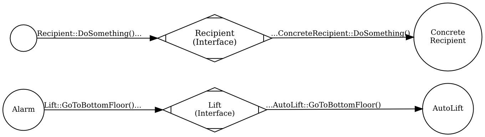

# Web, messages and protocols

In the previous chapter, we talked a little bit about why composability is valuable, now let's flesh out a little bit of terminology to get more precise understanding.

## So, again, what does it mean to compose objects?

Basically it means that an object has obtained a reference to another object and is able to invoke methods on it. By being composed together, two objects form a small system that can be expanded with more objects as needed. Thus, a bigger object-oriented system forms something similar to a web:


If we take the web metaphor a little bit further, we can note some similarities to e.g. a TCP/IP network:

1. An object can send **messages** to other objects (i.e. call methods on them -- arrows on the above diagram) via **interfaces**. Each message has a **sender** and at least one **recipient**.
1. To send a message to a recipient, a sender has to acquire an **address** of the recipient, which, in object-oriented world, we call a reference (and in languages such as C++, references are just that -- addresses in memory).
1. A communication between sender and recipients has to follow a certain **protocol**. For example, a sender usually cannot invoke a method passing nulls as all arguments, or should expect an exception if it does so. Don't worry if you don't see the analogy now -- I'll follow up with more explanation of this topic later).

## Alarms, again!

Let's try to apply this terminology to an example. Imagine that we have an anti-fire alarm system in an office. When triggered, this alarm system makes all lifts go to bottom floor, opens them and then disables each of them. Among others, the office contains automatic lifts, that contain their own remote control systems and mechanical lifts, that are controlled from the outside by a special custom-made mechanism.

Let's try to model this behavior in code. As you might have guessed, we will have some objects like alarm, automatic lift and mechanical lift. The alarm will control the lifts when triggered.

Firstly, we don't want the alarm to have to distinguish between an automatic and a mechanical lift -- this would only add complexity to the alarm system, especially that there are plans to add a third kind of lift -- a more modern one -- in the future. So, if we made the alarm aware of the different kinds of lifts, we would have to modify it each time a new kind of lift is introduced. Thus, we need a special **interface** (let's call it `Lift`) to communicate with both `AutoLift` and `MechanicalLift` (and `ModernLift` in the future). Through this interface, an alarm will be able to send messages to both types of lifts without having to know the difference between them.

```csharp
public interface Lift
{
  ...
}

public class AutoLift : Lift
{
  ...
}

public class MechanicalLift : Lift
{
  ...
}
```

Next, to be able to communicate with specific lifts through the `Lift` interface, an alarm object has to acquire **"addresses"** of the lift objects (i.e. references to them). We can pass these references e.g. through a constructor:

```csharp
public class Alarm
{
  private readonly IEnumerable<Lift> _lifts;

  //obtain "addresses" here
  public Alarm(IEnumerable<Lift> lifts)
  {
    //store the "addresses" for later use
    _lifts = lifts;
  }
}
```

Then, the alarm can send three kinds of **messages**: `GoToBottomFloor()`, `OpenDoor()`, and `DisablePower()` to any of the lifts through the `Lift` interface:

```csharp
public interface Lift
{
  void GoToBottomFloor();
  void OpenDoor();
  void DisablePower();
}
```

and, as a matter of fact, it sends all these messages when triggered. The `Trigger()` method on the alarm looks like this:

```csharp
public void Trigger()
{
  foreach(var lift in _lifts)
  {
    lift.GoToBottomFloor();
    lift.OpenDoor();
    lift.DisablePower();
  }
}
```

By the way, note that the order in which the messages are sent **does** matter. For example, if we disabled the power first, asking the powerless lift to go anywhere would be impossible. This is a first sign of a **protocol** existing between the `Alarm` and a `Lift`.

In this communication, `Alarm` is a **sender** -- it knows what it sends (messages that control lifts), it knows why (because the alarm is triggered), but does not know what exactly are the recipients going to do when they receive the message -- it only knows what it **wants** them to do, but does not know **how** they are going to achieve it. The rest is left to objects that implement `Lift` (namely, `AutoLift` and `MechanicalLift`). They are the **recipients** -- they don't know who they received the message from (unless they are told in the content of the message somehow -- but even then they can be cheated), but they know how to react, based on who they are (`AutoLift` has its own way of reacting and `MechanicalLift` has its own as well). They also know what kind of the message they received (a lift does a different thing when asked to go to bottom floor than when it is asked to open its door) and what's the message content (i.e. method arguments -- in this simplistic example there are none).

To illustrate that this separation between a sender and a recipient does, in fact, exist, I'll say that we could even write an implementation of a `Lift` interface that would just ignore the messages it got from the `Alarm` (or fake that it did what it was asked for) and the `Alarm` will not even notice. We sometimes say that this is because deciding on a specific reaction is not the `Alarm`'s responsibility.



### New requirements

It was decided that whenever any malfunction happens in the lift when it is executing the alarm emergency procedure, the lift object should report this by throwing an exception called `LiftUnoperationalException`. This affects both `Alarm` and implementations of the `Lift` interface:

1. The `Lift` implementations need to know that when a malfunction happens, they should report it by throwing the exception.
1. The `Alarm` must be ready to handle the exception thrown from lifts and act accordingly (e.g. still try to secure other lifts).

This is another example of a **protocol** existing between `Alarm` and `Lift` that must be adhered to by both sides. Here is an exemplary code of `Alarm` keeping to its part of the protocol, i.e. handling the malfunction reports in its `Trigger()` method:

```csharp
public void Trigger()
{
  foreach(var lift in _lifts)
  {
    try
    {
      lift.GoToBottomFloor();
      lift.OpenDoor();
      lift.DisablePower();
    }
    catch(LiftUnoperationalException e)
    {
      report.ThatCannotSecure(lift);
    }
  }
}
```

## Summary

Each of the objects in the web can receive messages and most of them send messages to other objects. Throughout the next chapters, I will refer to an object sending a message as **sender** and an object receiving a message as **recipient**.

For now, it may look unjustified to introduce this metaphor of webs, protocols, interfaces etc. Still, I have two reasons for doing so:

* This is the way I interpret [Alan Kay's](http://c2.com/cgi/wiki?AlanKayOnMessaging) mental model of what object-oriented programming is about.
* I find it useful for some things want to explain in the next chapters: how to make connections between objects, how to design an object boundary and how to achieve strong composability.

By the way, the example from this chapter is a bit naive. For one, in real production code, the lifts would have to be notified in parallel, not sequentially. Also, I would probably use some kind of observer pattern to separate the instructions give to each lift from raising an event (I will demonstrate an exmaple of using observers in this fashion in the next chapter). These two choices, in turn, would probably make me rethink error handling - there is a chance I wouldn't be able to get away with just catching exceptions. Anyway, I hope the naive form helped explain the idea of protocols and messages without raising the bar in other topics.