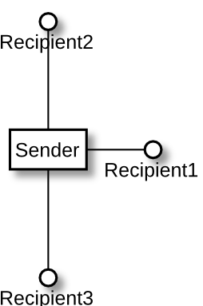

# Interfaces

Some objects are harder to compose with other objects, others are easier. Of course, we are striving for the higher composability. There are numerous factors influencing this. I already discussed some of them indirectly, so time to sum things up and fill in the gaps. This chapter will deal with the role interfaces play in achieving high composability and the next one will deal with the concept of protocols.

## Classes vs interfaces

As we said, a sender is composed with a recipient by obtaining a reference to it. Also, we said that we want our senders to be able to send messages to many different recipients. This is, of course, done using polymorphism. 

So, one of the questions we have to ask ourselves in our quest for high composability is: on what should a sender depend on to be able to work with as many recipients as possible? Should it depend on classes or interfaces? In other words, when we plug in an object as a message receipient like this:

```csharp
public Sender(Recipient recipient)
{
  this._recipient = recipient;
}
```

Should the `Recipient` be a class or an interface?

If we assume that `Recipient` is a class, we can get the composability we want by deriving another class from it and implementing abstract methods or overriding virtual ones. However, depending on a class as a base type for a recipient has the following disadvantages:

1. The recipient class may have some real dependencies. For example, if our `Recipient` depends on Windows Communication Foundation (WCF) stack, then all classes depending directly on `Recipient` will indirectly depend on WCF, including our `Sender`. The more damaging version of this problem is where such a `Recipient` class does something like opening a network connection in a constructor -- the subclasses are unable to prevent it, no matter if they like it or not, because a subclass has to call a superclass' constructor.
1. `Recipient`'s constructor must be invoked by any class deriving from it, which may be smaller or bigger trouble, depending on what kind of parameters the constructor accepts and what it does.
1. In languages that support single inheritance only, deriving from `Recipient` class uses up the only inheritance slot, constraining our design.
1. We must make sure to mark all the methods of `Recipient` class as `virtual` to enable overriding them by subclasses. otherwise, we won't have full composability. Subclasses will not be able to redefine all of the `Recipient` behaviors, so they will be very constrained in what they can do.

As you see, there are some difficulties using classes as "slots for composability", even if composition is technically possible this way. Interfaces are far better, just because they do not have the above disadvantages.

It is decided then that if a sender wants to be composable with different recipients, it has to accept a reference to a recipient in a form of interface reference. We can say that, by being lightweight and behaviorless, **interfaces can be treated as "slots" or "sockets" for plugging in different objects**.

As a matter of fact, on UML diagrams, one way to depict a class implementing an interface is by drawing it with a plug. Thus, it seems that the "interface as slot for pluggability" concept is not so unusual.



As you may have already guessed from the previous chapters, we are taking the idea of pluggability and composability to the extreme, making it one of the top priorities.

## Events/callbacks vs interfaces -- few words on roles

Did I just say that composability is "one of the top priorities" in our design approach? Wow, that's quite a statement, isn't it? Unfortunately for me, it also lets you raise the following argument: "Hey, interfaces are not the most extreme way of achieving composability! What about e.g. C\# events feature? Or callbacks that are supported by some other languages? Wouldn't it make the classes even more context-independent and composable, if we connected them through events or callbacks, not interfaces?"

Actually, it would, but it would also strip us from another very important aspect of our design approach that I did not mention explicitly until now. This aspect is: roles. When we use interfaces, we can say that each interface stands for a role for a real object to play. When these roles are explicit, they help design and describe the communication between objects.

Let's look at an example of how not defining explicit roles can remove some clarity from the design. This is a sample method that sends some messages to two recipients held as interfaces:

```csharp
//role players:
private readonly Role1 recipient1;
private readonly Role2 recipient2;

public void SendSomethingToRecipients()
{
  recipient1.DoX();
  recipient1.DoY();
  recipient2.DoZ();
}
```

and we compare it with similar effect achieved using callback invocation:

```csharp
//callbacks:
private readonly Action DoX;
private readonly Action DoY;
private readonly Action DoZ;

public void SendSomethingToRecipients()
{
  DoX();
  DoY();
  DoZ();
}
```

We can see that in the second case we are losing the notion of which message belongs to which recipient -- each callback is standalone from the point of view of the sender. This is unfortunate, because in our design approach, we want to highlight the roles each recipient plays in the communication, to make it readable and logical. Also, ironically, decoupling using events or callbacks can make composability harder. This is because roles tell us which sets of behaviors belong together and thus, need to change together. If each behavior is triggered using a separate event or callback, an overhead is placed on us to remember which behaviors should be changed together, and which ones can change independently.

This does not mean that events or callbacks are bad. It's just that they are not fit for replacing interfaces -- in reality, their purpose is a little bit different. We use events or callbacks not to tell somebody to do something, but to indicate what happened (that's why we call them events, after all...). This fits well the observer pattern we already talked about in the previous chapter. So, instead of using observer objects, we may consider using events or callbacks instead (as in everything, there are some tradeoffs for each of the solutions). In other words, events and callbacks have their use in the composition, but they are fit for a case so specific, that they cannot be treated as a default choice. The advantage of interfaces is that they bind together messages that represent a coherent abstractions and convey roles in the communication. This improves readability and clarity.

## Small interfaces

Ok, so we said that he interfaces are "the way to go" for reaching the strong composability we're striving for. Does merely using interfaces guarantee us that the composability will be strong? The answer is "no" -- while using interfaces as "slots" is a necessary step in the right direction, it alone does not produce the best composability.

One of the other things we need to consider is the size of interfaces. Let's state one thing that is obvious in regard to this:

**All other things equal, smaller interfaces (i.e. with less methods) are easier to implement than bigger interfaces.**

The obvious conclusion from this is that if we want to have really strong composability, our "slots", i.e. interfaces, have to be as small as possible (but not smaller -- see previous section on interfaces vs events/callbacks). Of course, we cannot achieve this by blindly removing methods from interfaces, because this would break classes that use these methods e.g. when someone is using an interface implementation like this:

```csharp
public void Process(Recipient recipient)
{
  recipient.DoSomething();
  recipient.DoSomethingElse();
}
```

It is impossible to remove either of the methods from the `Recipient` interface, because it would cause a compile error saying that we are trying to use a method that does not exist.

So, what do we do then? We try to separate groups of methods used by different senders and move them to separate interfaces, so that each sender has access only to the methods it needs. After all, a class can implement more than one interface, like this:

```csharp
public class ImplementingObject
: InterfaceForSender1,
  InterfaceForSender2,
  InterfaceForSender3
{ ... }
```

This notion of creating a separate interface per sender instead of a single big interface for all senders is known as the Interface Segregation Principle[^interfacesegregation].

### A simple example: separation of reading from writing

Let's assume we have a class in our application that represents enterprise organizational structure. This application exposes two APIs. The first one serves for notifications about changes of organizational structure by an administrator (so that our class can update its data). The second one is for client-side operations on the organizational data, like listing all employees. The interface for the organizational structure class may contain methods used by both these APIs:

```csharp
public interface 
OrganizationStructure
{
  //////////////////////
  //used by administrator:
  //////////////////////  
  
  void Make(Change change);
  //...other administrative methods
  
  //////////////////////
  //used by clients:
  //////////////////////
  
  void ListAllEmployees(
    EmployeeDestination destination);
  //...other client-side methods  
}
```

However, the administrative API handling is done by a different code than the client-side API handling. Thus, the administrative part has no use of the knowledge about listing employees and vice-versa -- the client-side one has no interest in making administrative changes. We can use this knowledge to split our interface into two:

```csharp
public interface
OrganizationalStructureAdminCommands
{
  void Make(Change change);
  //... other administrative methods
}

public interface
OrganizationalStructureClientCommands
{
  void ListAllEmployees(
    EmployeeDestination destination);
  //... other client-side methods
}
```

Note that this does not constrain the implementation of these interfaces -- a real class can still implement both of them if this is desired:

```csharp
public class InMemoryOrganizationalStructure
: OrganizationalStructureAdminCommands,
  OrganizationalStructureClientCommands
{
  //...
}
```

In this approach, we create more interfaces (which some of you may not like), but that shouldn't bother us much, because in return, each interface is easier to implement (because the number of methods to implement is smaller than in case of one big interface). This means that composability is enhanced, which is what we want the most. 

It pays off. For example, one day, we may get a requirement that all writes to the organizational structure (i.e. the admin-related operations) have to be traced. In such case, all we have to do is to create a proxy class implementing `OrganizationalStructureAdminCommands` interface, which wraps the original class' methods with a notification to an observer (that can be either the trace that is required or anything else we like):

```csharp
public class NotifyingAdminComands : OrganizationalStructureAdminCommands
{
  public NotifyingCommands(
    OrganizationalStructureAdminCommands wrapped,
    ChangeObserver observer)
  {
    _wrapped = wrapped;
    _observer = observer;
  }

  void Make(Change change)
  { 
    _wrapped.Make(change);
    _observer.NotifyAbout(change);
  }
  
  //...other administrative methods
}
```

Note that when defining the above class, we only had to implement one interface: `OrganizationalStructureAdminCommands`, and could ignore the existence of `OrganizationalStructureClientCommands`. This is because of the interface split we did before. If we had not separated interfaces for admin and client access, our `NotifyingAdminComands` class would have to implement the `ListAllEmployees` method (and others) and make it delegate to the original wrapped instance. This is not difficult, but it's unnecessary effort. Splitting the interface into two smaller ones spared us this trouble. 

#### Interfaces should model roles

In the above example, we split the one bigger interface into two smaller, in reality exposing that the `InMemoryOrganizationalStructure` class objects can play two roles.

Considering roles is another powerful way of separating interfaces. For example, in the organizational structure we mentioned above, we may have objects of class `Employee`, but that does not mean this class has to implement an interface called `IEmployee` or `EmployeeIfc` of anything like that. Honestly speaking, this is a situation that we may start of with, when we don't have better ideas yet, but would like to get away from as soon as we can through refactoring. What we would like to do as soon as we can is to recognize valid roles. In our example, from the point of view of the structure, the employee might play a `Node` role. If it has a parent (e.g. an organization unit) it belongs to,  from its perspective it might play a `ChildUnit` role. Likewise, if it has any children in the structure (e.g. employees he manages), he can be considered their `Parent` or `DirectSupervisor`. All of these roles should be modeled using interfaces which `Employee` class implements:

```csharp
public class Employee : Node, ChildUnit, DirectSupervisor
{
 //...
```

and each of those interfaces should be given only the methods that are needed from the point of view of objects interacting with a role modeled with this interface.

#### Interfaces should depend on abstractions, not implementation details

It is tempting to think that every interface is an abstraction by definition. I believe otherwise -- while interfaces abstract away the concrete type of the class that implements it, they may still contain some other things not abstracted that are basically implementation details. Let's look at the following interface:

```csharp
public interface Basket
{
  void WriteTo(SqlConnection sqlConnection);
  bool IsAllowedToEditBy(SecurityPrincipal user);
}
```

See the arguments of those methods? `SqlConnection` is a library object for interfacing directly with SQL Server database, so it is a very concrete dependency. `SecurityPrincipal` is one of the core classes of .NET's authorization library that works with users database on local system or Active Directory. So again, a very concrete dependency. With dependencies like that, it will be very hard to write other implementations of this interface, because we will be forced to drag around concrete dependencies and mostly will not be able to work around that if we want something different. Thus, we may say that these concrete types I mentioned are implementation details exposed in the interface. Thus, this interface is a failed abstraction. It is essential to abstract these implementation details away, e.g. like this:

```csharp
public interface Basket
{
  void WriteTo(ProductOutput output);
  bool IsAllowedToEditBy(BasketOwner user);
}
```

This is better. For example, as `ProductOutput` is a higher level abstraction (most probably an interface, as we discussed earlier) no implementation of the `WriteTo` method must be tied to any particular storage kind. This means that we are more free to develop different implementations of this method. In addition, each implementation of the `WriteTo` method is more useful as it can be reused with different kinds of `ProductOutput`s.

Another example might be a data interface, i.e. an interface with getters and setters only. Looking at this example:

```csharp
public interface Employee
{
  HumanName Name { get; set; }
  HumanAge  Age { get; set; }
  Address Address { get; set; }
  Money Pay { get; set; }
  EmploymentStatus EmploymentStatus { get; set; }
}
```

in how many different ways can we implement such interface? Not many -- the only question we can answer differently in different implementations of `Employee` is: "what is the data storage?". Everything besides this question is exposed, making this a very poor abstraction. As a matter of fact, this is similar to what Johnny and Benjamin were battling in the payroll system, when they wanted to introduce another kind of employee -- a contractor employee. Thus, most probably, a better abstraction would be something like this:

```csharp
public interface Employee
{
  void Sign(Document document);
  void Send(PayrollReport payrollReport);
  void Fire();
  void GiveRaiseBy(Percentage percentage);
}
```

So the general rule is: make interfaces real abstractions by abstracting away the implementation details from them. Only then are you free to create different implementations of the interface that are not constrained by dependencies they do not want or need.

[^interfacesegregation]: http://butunclebob.com/ArticleS.UncleBob.PrinciplesOfOod
